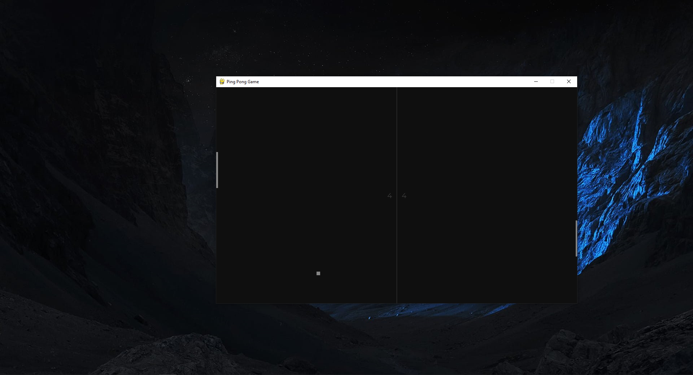
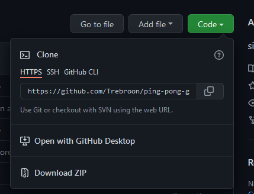

# Ping Pong Game

>Ping pong game for two players with score tracking made with Python and Pygame libary. 

---

## Table of Contents

- [Description](#description)
- [Installation](#installation)
- [How To Use](#how-to-use)
- [Room for Improvement](#room-for-improvement)
- [Contact](#contact)

---

## Description

Ping pong game for two players with score tracking made with Python and Pygame libary. 

---

## Installation

Before you and your friends can play Ping Pong, there are few step, you need to do, so you are able to run it on your computer.

### Python

First you need to have Python installed on your OS. You can download Python from its offcial website python.org and install it.

### Cloning Repo

After you have successfully installed python, you need to clone this repo to your computer. You can do this by clicking the code button and copy the link.

After that, create a directory where you want to clone this app cd into this directory. Then write this line into terminal line:

`git clone https://github.com/Trebroon/ping-pong-game.git`

### Pygame

When repository is cloned to direcotry, run this code in your terminal to install all required libaries:

`pip install -r requirements.txt`

---

## How to Use

With Python and Pygame installed and repository cloned in our computer, we can write this line into the terminal and start playing the game:

`python3 main.py`

### Controls

Player One controls - Press W for Up, Press S for Down  
Player Two controls - Press Up Arrow for Up, Press Down Arrow for Down  
To Start a game - Press SpaceBar  
To Restart - Press R  

---

## Room for Improvement

- Implement an AI opponent
- Make application an executable 

---

## Contact

Created by [Norbert Leipold](http://norbertleipold.com/) - feel free to contact me

[back to top](#ping-pong-game)

